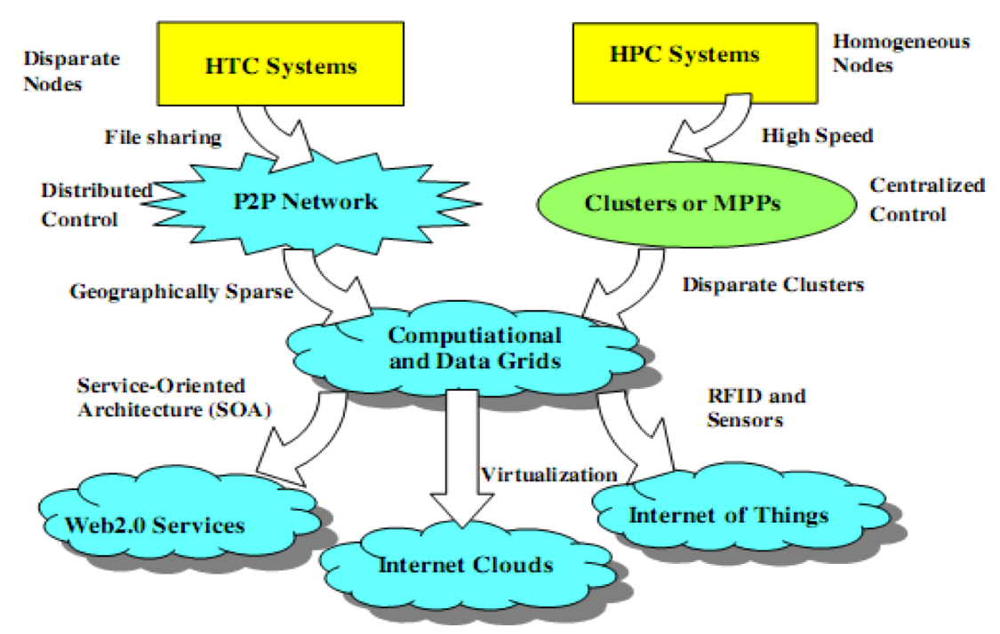
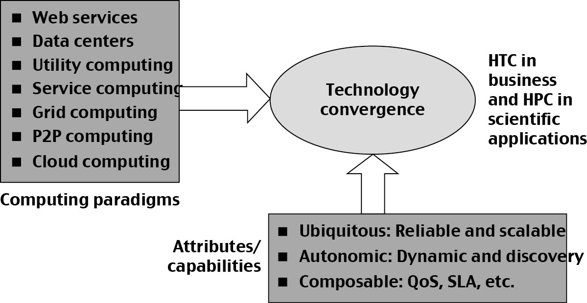

# Course Summary
## Distributed and Cloud Computing - Module Aim
* This module is designed to develop the student's understanding of Distributed Systems architectures based on their existing knowledge of Operating Systems and Networking.

## Learning Outcomes
On successful completion of this module the learner will/should be able to

1. analyze the issues involved in the development and deployment of distributed systems
2. deploy basic systems utilising distributed technologies
3. critically analyse the issues involved in developing Web services
4. design XML documents and schemas

# Syllabus
## Unit 1: Introduction to Distributed Systems     
* Client Server Options 
* N-tier Systems

## Unit 2: Principles of Distributed Systems   
* Interprocess Communication 

* Transparency 

* Components versus Objects

## Unit 3: Distributed System architectures
* Remote Procedures, Messaging

* Distributed System Technologies       
   - Features of Distributed Technologies 
   - Distributed Resources
   - Deployment of Distributed Objects
   - Security and Authentication

## Unit 4: Internet Technologies       
* Features of Web Services (Cloud)

* XML and SOAP 

* Impact of web-based systems

## Unit 5: Cloud 

* Data Centres

* Infrastructure - Networking

* Technology

# Assessment
## Assessment
* Continuous Assessment = 40%
	- Mid-Year Exam = 20%
	- Practicals / Assignments = 20%

* Final Exam = 60%

## Practical Work
* Develop examples showing ways things work
	- Protocols
	- Methods
	- Communication styles
	- Vagrant / Docker / Python
	- Aws / Azure

# Introduction to Distributed and Cloud Computing

## Scalable Computing over the Internet
Over the past 60 years, computing technology has undergone a series of platform and environment changes. 

* evolutionary changes in:

	- machine architecture
	- operating system platform
	- network connectivity
	- application workload
	
Instead of using a centralized computer to solve computational problems, a parallel and distributed computing system uses multiple
computers to solve large-scale problems over the Internet. 

Thus, distributed computing becomes data-intensive and network-centric. 

## The Age of Internet Computing
* Billions of people use the Internet every day

* Supercomputer sites and large data centers must provide high-performance computing services to huge numbers of Internet users concurrently

* The Linpack Benchmark[^1] for high-performance computing (HPC)
applications is no longer optimal for measuring system performance.

* The emergence of computing clouds instead demands high-throughput computing (HTC) systems built with parallel and distributed computing technologies

[^1]: http://www.netlib.org/utk/people/JackDongarra/faq-linpack.html

## The Platform Evolution

## High-Performance Computing

* For many years, HPC systems emphasize the raw speed performance. The speed of HPC systems has increased from Gflops in the early 1990s to Pflops in 2010.

* The Top 500 most powerful computer systems in the world are measured by floating-point speed in Linpack benchmark results.

* However, the number of supercomputer users is limited to less than 10% of all computer users. 

* Today, the majority of computer users are using desktop computers or large servers when they conduct Internet searches and market-driven computing tasks. 

## High-Throughput Computing 
* The development of market-oriented high-end computing systems is undergoing a strategic change 
	- from an HPC paradigm to an HTC paradigm. 

* This HTC paradigm focusses on high-flux computing,  the main application of which is in Internet searches and web services by millions or more users simultaneously. 

* The performance goal thus shifts to measure high throughput or the number of tasks completed per unit of time. 

* HTC technology needs to not only improve in terms of batch processing speed, but also address the acute problems of cost, energy savings, security, and reliability at many data and enterprise computing centers. 

## New Paridgms

When the Internet was introduced in 1969, Leonard Klienrock of UCLA declared: 

>As of now, computer networks are still in their infancy, but as they grow up and become sophisticated, we will probably see the spread of computer utilities, which like present electric and telephone utilities, will service individual homes and offices across the country.

Many people have redefined the term "computer" since that time. In 1984, John Gage of Sun Microsystems created the slogan: 

> The network is the computer.

## New Paridgms (cont'd)

In 2008, David Patterson of UC Berkeley said:

> The data center is the computer. There are dramatic differences between developing software for millions to use as a service versus distributing software to run on their PCs. 

Recently, Rajkumar Buyya of Melbourne University simply said: 

> The cloud is the computer.

## Computing Paradigm Distinctions

* Centralised Computing 

	+ All computer resources are centralised in one physical system.

* Parallel Computing
	- All processors are either tightly coupled with central shard memory or loosely coupled with distributed memory

* Distributed Computing
	- Field of CS/CE that studies distributed systems. A distributed system consists of multiple autonomous computers, each with its own private memory, communicating over a network.

* Cloud Computing
	- An Internet cloud of resources that may be either centralized or decentralized. The cloud apples to parallel or distributed computing or both. Clouds may be built from physical or virtualized resources.

## Technology Convergence toward HPC for Science and HTC for Business: Utility Computing

# Summary

## Thank You

\begin{center}
\LARGE{Questions?}
\end{center}
 
---
nocite: | 
	@hwang, @CloudComputingPP, @colourisl, @Chou, @HeyTansleyToile, @WebServicesEssentials, @CloudSystemAdministration
---

## References{.allowframebreaks}
