  

## The Gartner Hype Cycle of New Technologies
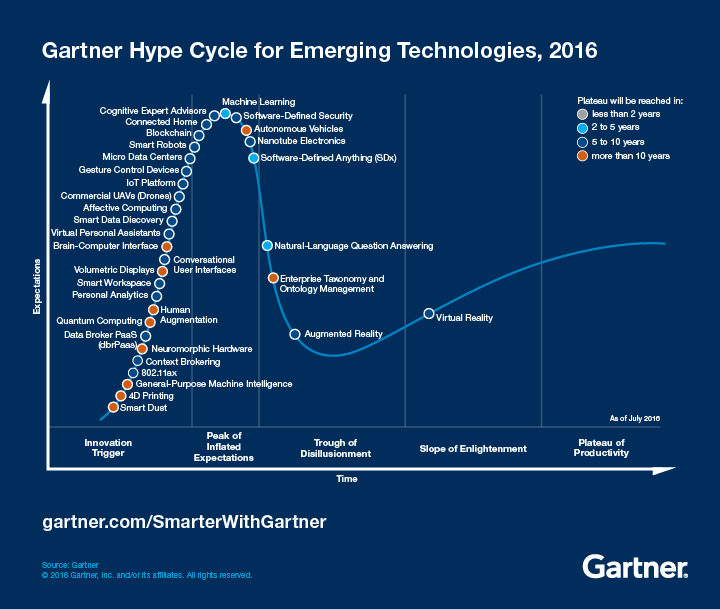[^2]

[^2]: http://www.gartner.com/technology/research/methodologies/hype-cycle.jsp

## Scalable Computing Trends and New Paradigms

* Several predictable trends in technology are known to drive computing applications.
	+ Jim Gray's paper, "Rules of Thumb in Data Engineering,"[^gray]
	+ Moore's law indicates that processor speed doubles every 18 months.
	+ Gilder's law indicates that network bandwidth has doubled each year in the past.

[^gray]: http://research.microsoft.com/pubs/68636/ms_tr_99_100_rules_of_thumb_in_data_engineering.pdf 
	
## Degrees of Parallelism
* 50 years ago
	+ bit-level parallelism (BLP) converts bit-serial processing to
word-level processing gradually.

* 30 years ago to present
	+ 4-bit microprocessors to 8-,16-, 32-, and 64-bit CPU
		+ instruction-level parallelism (ILP), processor executes multiple instructions simultaneously 
		+ For the past 30 years, we have practiced ILP through pipelining, superscalar computing, VLIW (very long instruction word) architectures, and multithreading
	+ Data-level parallelism (DLP) was made popular through SIMD (single instruction, multiple data) and vector machines
	+ multicore processors and chip multiprocessors (CMPs) give us task-level parallelism (TLP)
	
* Moving parallel processing to distributed processing, we see an increase in computing granularity to job-level parallelism (JLP).

# The Internet of Things and Cyber-Physical Systems
 
## The Internet of Things

* The concept of the IoT was introduced in 1999 at MIT

* The IoT refers to the networked interconnection of everyday objects, tools, devices, or computers. 

* One can view the IoT as a wireless network of sensors that interconnect all things in our daily life.

* IoT researchers have estimated that every human being will be surrounded by 1,000 to 5,000 objects.

## Cyber-Physical Systems
* A cyber-physical system (CPS) is the result of interaction between computational processes and the physical world. 

* A CPS integrates "cyber" (heterogeneous, asynchronous) with "physical" (concurrent and information-dense) objects.

* A CPS merges the "3C" technologies of computation, communication, and control into an intelligent closed feedback system between the physical world and the information world

* The IoT emphasizes various networking connections among physical objects, while the CPS emphasizes exploration of virtual reality (VR) applications in the physical world.

# Multicore CPUs and Multithreading Technologies
## Advances in CPU Processors 
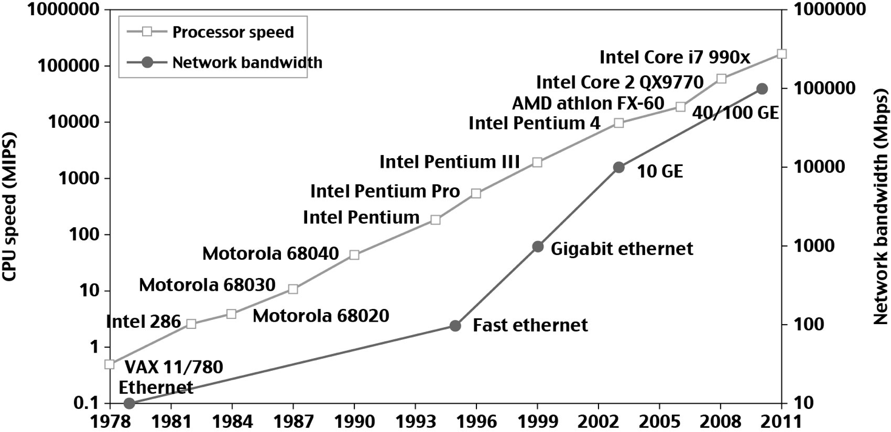

## Modern Multi-core CPU Chip

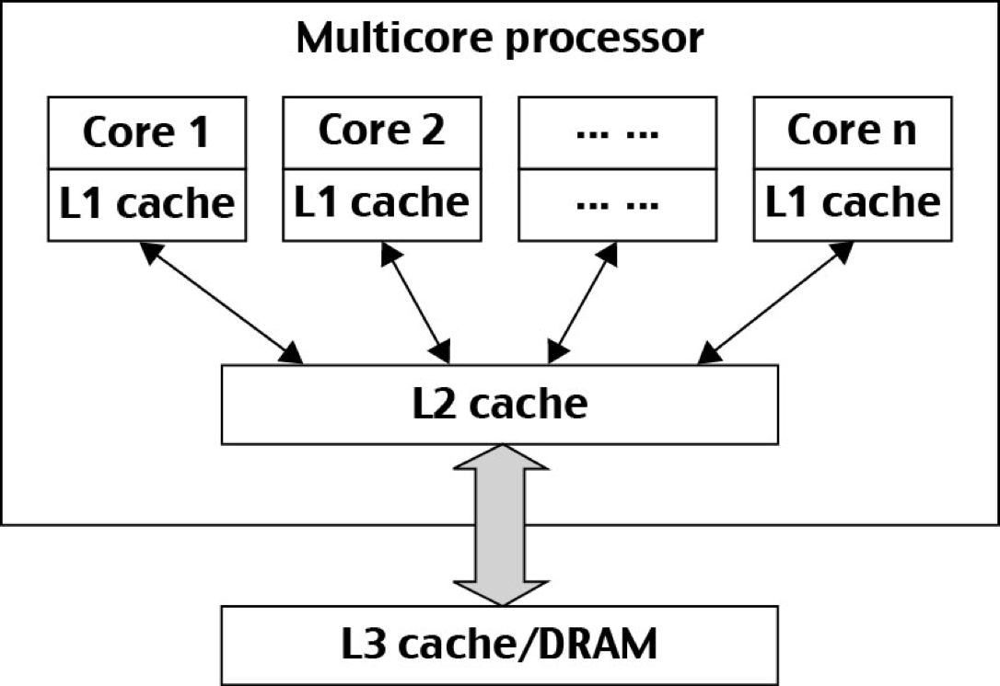 

## Multicore CPU and Many-Core GPU Architectures

* Multicore CPUs may increase from the tens of cores to hundreds or more in the future.

* but CPU has reached its limit in terms of exploiting massive DLP due to the memory wall problem [^memorywall]
	+ This has triggered the development of many-core GPUs with thousands or more thin cores
	+ Many RISC processors have been replaced with multicore x-86 processors and many-core GPUs in the Top 500 systems.
	+ The GPU also has been applied in large clusters to build supercomputers in MPPs

[^memorywall]: http://www.di.unisa.it/~vitsca/SC-2011/DesignPrinciplesMulticoreProcessors/Wulf1995.pdf

## Multithreading Technology
* Four-issue superscalar (e.g. Sun Ultrasparc I)
	+ Implements instruction level parallelism (ILP) within a single processor. 
	+ Executes more than one instruction during a clock cycle by sending multiple instructions to redundant functional units. 

* Fine-grain multithreaded processor
	+ Switch threads after each cycle
	+ Interleave instruction execution
	+ If one thread stalls, others are executed

* Coarse-grain multithreaded processor
	+ Executes a single thread until it reaches certain situations

* Simultaneous multithread processor (SMT) 
	+ Instructions from more than one thread can execute in any given pipeline stage at a time. 

# CPU and GPU based Architectures 

## 5 Micro-architectures of CPUs
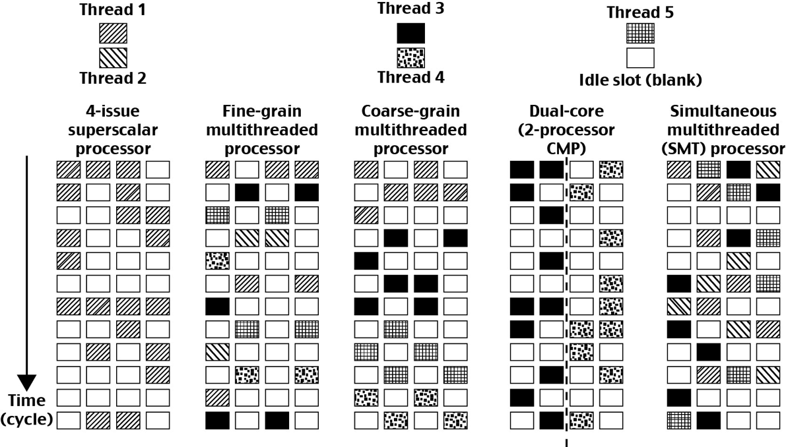
* Each row represents the issue slots for a single execution cycle:
* A filled box indicates that the processor found an instruction to execute in that issue slot on that cycle
* An empty box denotes an unused slot.

## GPU Computing to Exascale and Beyond
* A GPU is a graphics coprocessor or accelerator mounted on a computer's graphics card or video card. A GPU offloads the CPU from tedious graphics tasks in video editing applications

* Unlike CPUs, GPUs have a throughput architecture that exploits massive parallelism by executing many concurrent threads slowly, instead of executing a single long thread in a conventional microprocessor very quickly

* General-purpose computing on GPUs, known as GPGPUs, have appeared in the HPC field and power exacale[^Exascale] 

* NVIDIA's CUDA model was for HPC using GPGPUs

[^Exascale]: Exascale computing refers to computing systems capable of at least one exaFLOPS, or a billion billion calculations per second. Such capacity represents a thousandfold increase over the first petascale computer that came into operation in 2008.

## Architecture of A Many-Core Multiprocessor GPU interacting  with a CPU Processor

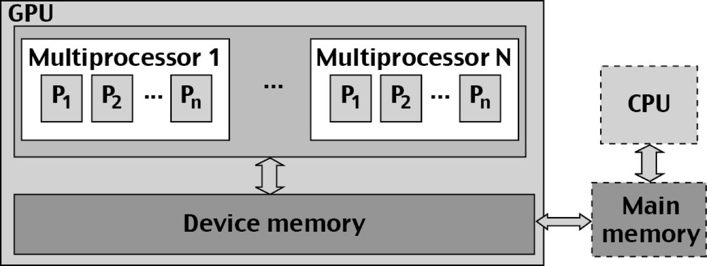

## NVIDIA Fermi GPU

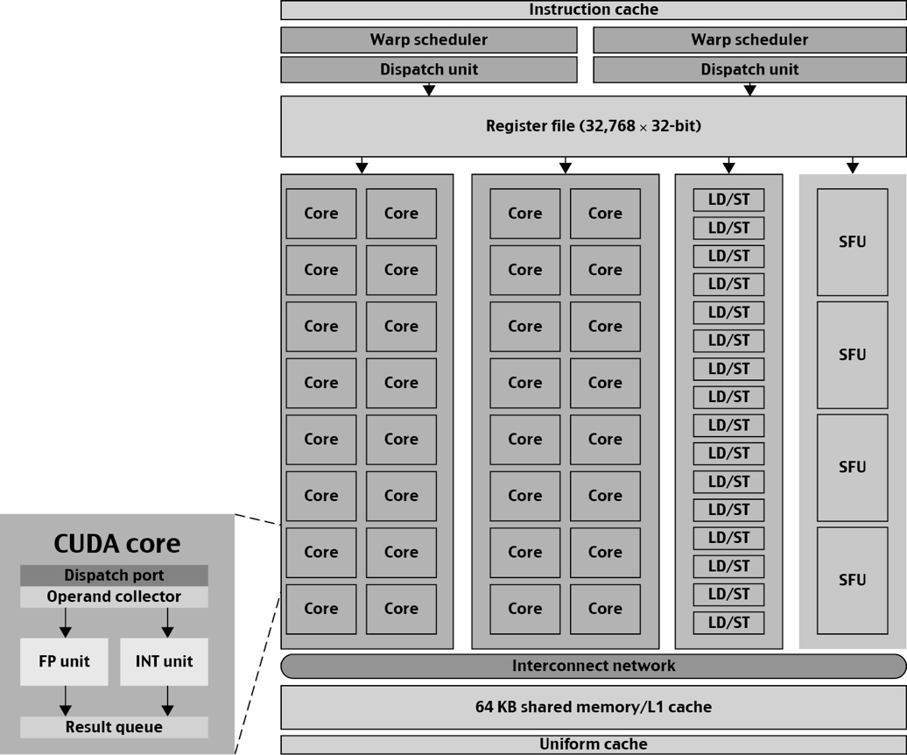

## Power Efficiency of the GPU

Bill Dally of Stanford University considers power and massive parallelism as the major benefits of GPUs over CPUs for the future

## GPU Performance

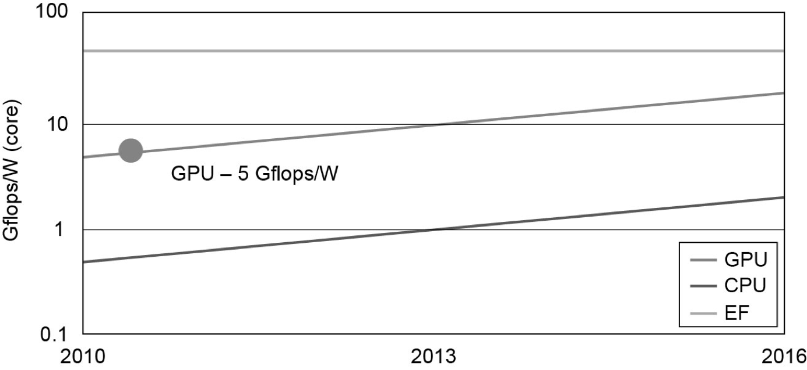

* Bottom - CPU - 0.8 Gflops/W/Core (2011)
* Middle - GPU - 5 Gflops/W/Core (2011)
* Top - EF - Exascale computing (10^18 Flops)

## Memory, Storage, and Wide-Area Networking

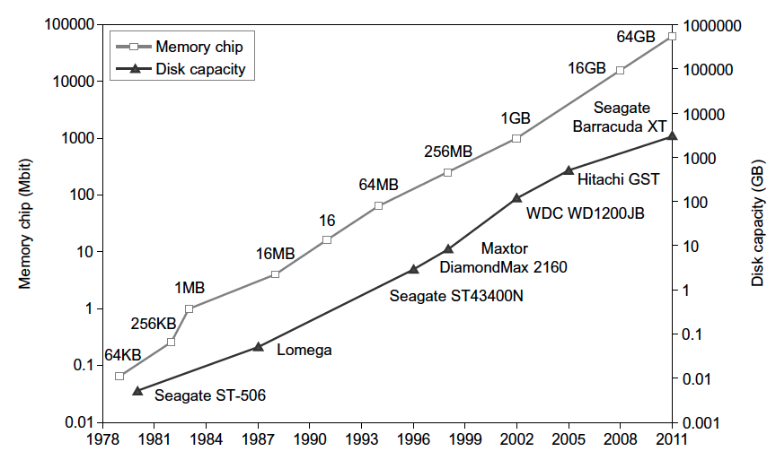

# System-Area Interconnects
## Network Interconnections
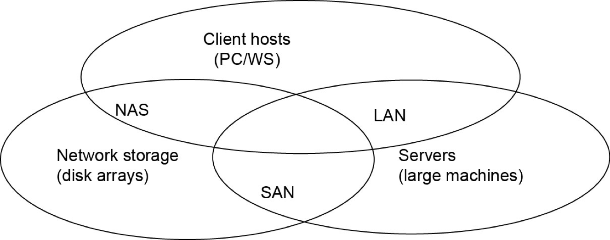

## Network Interconnections

* SAN (storage area network) - connects servers with disk arrays
* LAN (local area network) - connects clients, hosts, and servers
* NAS (network attached storage) - connects clients with large storage systems 

 

## Wide Area Networking

## Wide Area Networking

* The lower curve here plots the rapid growth of Ethernet bandwidth from 10 Mbps in 1979 to 1 Gbps in 1999, and 40 ~ 100 GE in 2011.
	
* We have recently seen a 255Tbps link created in 2014 [^255tps]

[^255tps]: http://bit.ly/cnsm4dcc-255tbps

# Virtualisation
## Virtual Machines and Virtualization Middleware

* A conventional computer has a single OS image. This offers a rigid architecture that tightly couples application software to a specific hardware platform. 

* Some software running well on one machine may not be executable on another platform with a different instruction set under a fixed OS. 

* Virtual machines (VMs) offer novel solutions to underutilized resources, application inflexibility, software manageability, and security concerns in existing physical machines.

## VM Architectures

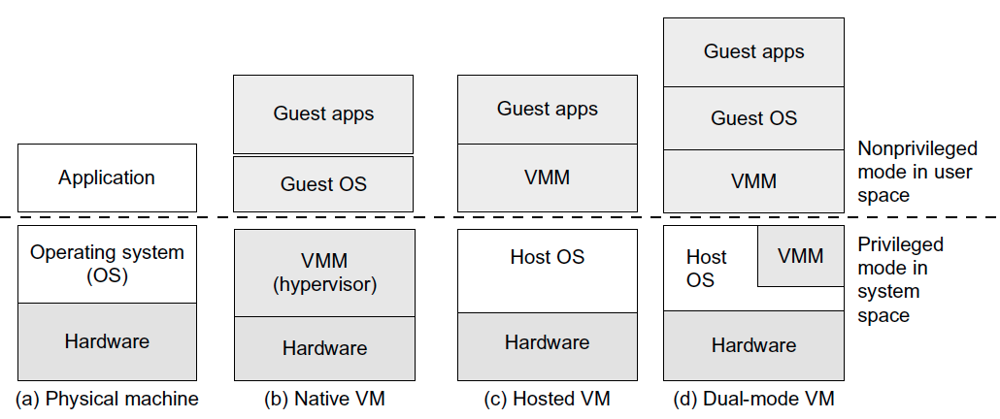

## VM Operations

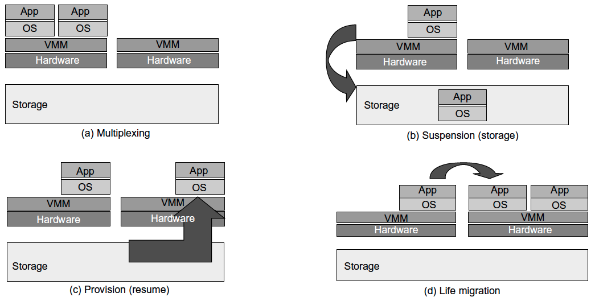

## Next Lesson
* Cloud Centres
    + What are they ?
    + Are they all the same ?
    + Whats different about them ?

## Thank You

\begin{center}
\LARGE{Questions?}
\end{center}

## References{.allowframebreaks}
